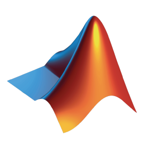

### Luke de Waal

I'm Luke de Waal and I am currently an Embedded Software Engineer at [QBlox](https://www.qblox.com/) and dual master graduate from [TU Delft](https://www.tudelft.nl/) :
- MSc. Aerospace Engineering: Simulation & Control
- MSc. Embedded Systems: Software & Networking

My Programming Languages of choice are:
-   Python
-  C
-  C++

Other Programming Languages I know:
-  Nim
-  Go
-  Java
-  Matlab

I am also familiar with:
-  VHDL
-  LaTeX
-  HTML
-  Bash
