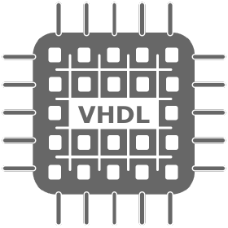

### Luke de Waal

I'm Luke de Waal and I am currently a dual master student at [TU Delft](https://www.tudelft.nl/)  studying:
- Aerospace Engineering: Simulation & Control
- Embedded Systems: Software & Networking

My Programming Languages of choice are:
-   Python
-  C
-  C++

Other Programming Languages I know:
-  Nim
-  Go
-  Java
-  Matlab

I am also familiar with:
-  VHDL
- LaTeX
- HTML
- Bash
